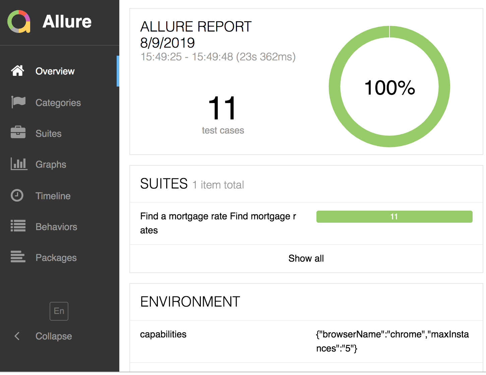

# Webdriver.io + CucumberJS automation test

This repository contains automated tests for a mortgage product search.


### Prerequisites

Please make sure to install the following to use the test framework.

```
Java - 1.8
Node - v10.16.2
Chrome Browser - v75
```

## Built With

* WebdriverIO
* Selenium
* Chai
* Allure

## Framework Features
* Runs automated tests on Chrome browser
* Logging
* Detailed Test Reporting


### Installing

Clone the [repository](https://github.com/venkata-qe/hotel-booking-testing) or download the Zip file directly into your local machine and extract it.


## Running the tests

Go to the project directory(../automation-test) and run the below npm command to execute the tests.

#### To run all the tests in the project

```
npm install
npm test

```

#### To run specific tests using cucumber tags

```
npm run test -- -t @tag-a```
```


### Example Test

Below is the example test
```
   Scenario: Find mortgage rates
     Given I open the url "https://www.nationwide.co.uk"
     And I navigate to the New mortgage customer rates screen
     And I select "no" for the Do you have a Nationwide mortgage? option
     And I select "I'm changing lender" for the What type of mortgage are you looking for? option
     And I enter "300,000" on the Property field
     And I enter "150,000" on the Mortgage field
     And I enter "30" on the Term field
     When I click on the Find a mortgage rate button
     And I select the Mortgage type filter to Fixed rate
     And I select the Product fee filter to With fee
     Then I should see the following products
        | 2 yr  Fixed    |
        | 3 yr  Fixed   |
        | 5 yr  Fixed   |
        | 10 yr  Fixed  |

```


## Reporting

After executing the tests we can generate the test report using allure command.

```
 npm run allure-report
```
Allure will start a Web server automatically and render the results in default browser.

#### Example report


